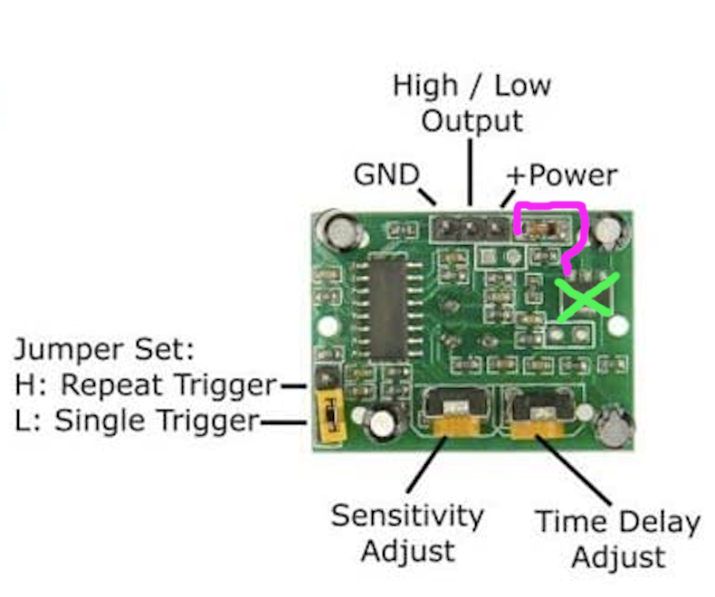

# Signpost
An electronic signpost with automatic left/right signals for sports. 

## Interface

The signpost uses a motion sensor to trigger an event, which shows a left or right signal (random order or alternating). The signpost can also signal an interval (5, 10, 15, or 30 seconds) that starts with a "go" signal and ends with a random left/right arrow. Modes are selected by the mode button. 

## Components

* TP4056 Li-poly charger and under-voltage protection circuit

  * Amazon
  * May need to modify to reduce charging rate for a lower energy cell. See the datasheet for current-limiting R values. I replaced the stock 1.2k (1A charge current) with a 3.3k (<400mA charge current) for a 380mAh LiPo cell (approximately a 1C charging rate).

* PIR (motion) sensor

  * https://www.adafruit.com/product/189

  * remove/bypass the voltage regulator to power from 3.3V

    

* Adafruit Trinket M0

  * https://www.adafruit.com/product/3500

* Neopixels (WS2812B)

  * https://www.adafruit.com/product/4356
  * Future: add a custom PCB to hold these directly without having to wire them by hand...

* Momentary push button (momentary SPDT) 6mm

* Sliding power switch (DPDT)

* Li-Poly battery (~400mAh)

* 100-1000uF electrolytic capacitor

## Power

The Trinket M0 has a nice on-board power path: battery and USB bus voltages are OR'd (through two Schottky diodes) into a AP2112 3.3V 600mA LDO. The AP2112 has a max 400mV dropout, but nominally that drops to less than 200mV below 400mA output current, so it works fine with a LiPo cell (3.7V - less than 200mV dropout - say 300mV Schottky diode = 3.2V). It can also easily regulate the battery while charging (4.2V).

Both input levels (3.7V for the battery, 5V for the USB bus) will power the NeoPixels. Technically, a level shifter is required for the data line from the M0 to the NeoPixels when the supply is 5V and the processor is running at 3.3V (spec says "high" is within 70% of Vdd), but everything will work fine on battery power. I've tried both (with the 74HCT125 as a level shifter and directly writing to the NeoPixels at 3.3V), and both work for prototyping. However, because both the battery and USB bus voltages are inputs to the LDO, prototyping requires a manual jumper to switch back and forth between sources.

